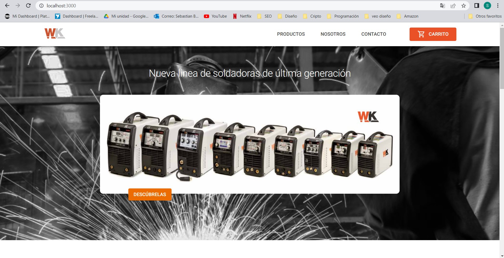

# ABOUT THE PROJECT
🌐 WK WELDING E-COMMERCE WEB PAGE
This is the page of WK Welding (a company specialized in welding), where users can get to know the company, buy its products and contact it.

🏁 COMPLETION OF THE PROJECT
The project is currently being worked on and will end on July 7, 2022. 

## TOOLS PROJECT
⚒️ To create the site, these tools were mainly used: 

❤️ REACT JS : React is an open source Javascript library designed to create user interfaces with the aim of facilitating the development of applications in a single page.

✨ UI MATERIAL : Components, icons, styles, and layout grids of "Material UI" taken from
https://mui.com/

🔙 BACKEND : Using Firebase to call items that are hosted on the backend and to send order and contact information.

🎨 SASS: Sass was used to be able to articulate the style of the project.

🖌️ Images and vectors were worked with illustrator and photoshop.

## TO START PROGRAM

### Getting Started with Create React App
This project was bootstrapped with [Create React App](https://github.com/sebastianbarcia/wk-welding.git).
Is open source code for modify to improve the proyect.

### Install
You can Install de repository from here: 
`https://github.com/sebastianbarcia/wk-welding.git`\
Open in branch "final_project-WK"

### Node modules    
Please install node modules. Go to terminal, once there type npm i. 

### Available Scripts
In the project directory, you can run:

### `npm start`

Runs the app in the development mode.\
Open [http://localhost:3000](http://localhost:3000) to view it in your browser.

Your browser should show this:

The page will reload when you make changes.\
You may also see any lint errors in the console.

### IF YOU WOULD LIKE TO CONTRIBUTE TO OUR SITE, CREATE A BRANCH ON GITHUB AND `Push to github repository ` 
git branch new_branch 
git checkout new_branch
git add all / git add .
git commit -m "Nuevo mensaje"
git push https://github.com/sebastianbarcia/wk-welding.git

## TESTS WEB PAGE 
The site was tested with different people to measure its usability and user experience.

### WATCH THE DEMO ON LAPTOP SCREEN:

### WATCH THE DEMO ON MOBILE SCREEN:

## CONTRIBUTORS
🎁 Many thanks to my class tutor Christian Chavez and Professor Christian Ortiz. 
❤️ Many thanks to my family: Eliana, Paz and Borja and also to me 🐶 Shanti

## LICENCE 
This project is licensed under the Sebastian Barcia License and was created for use in Coderhouse's reactJS course

⌨️ with ❤️ by Sebastian Barcia 😊

## ABOUT ME

const sebastianbarcia = {
  pronouns: "he" | "him",
  code: [Javascript, HTML, CSS],
  tools: [React, Bootstrap, MUI, Git, Sass, Adobe XD, Figma, Illustrator, Photoshop],
}

- 👨‍💻 All of my projects are available at [https://github.com/sebastianbarcia](https://github.com/sebastianbarcia)

- 💬 Ask me about **React JS, Javascript, HTML5, CSS3**

- 📫 How to reach me **sebastianbarcia@hotmail.com**

Follow me! [Linkedin] https://www.linkedin.com/in/sebastian-barcia/

